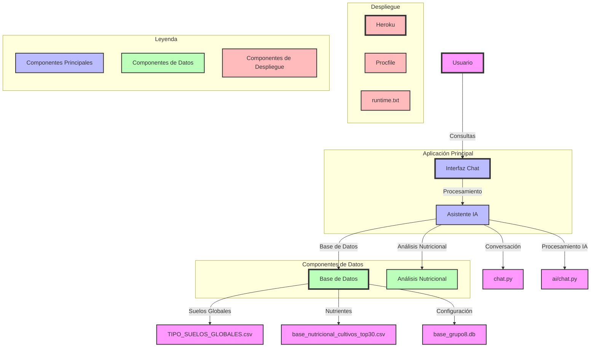

```mermaid
graph TD
    %% Nodes
    User[Usuario] -->|Consultas| ChatInterface[Interfaz Chat]
    ChatInterface -->|Procesamiento| AIAssistant[Asistente IA]
    AIAssistant -->|Base de Datos| Database[Base de Datos]
    AIAssistant -->|Análisis Nutricional| NutrientAnalysis[Análisis Nutricional]
    
    %% Subgraphs
    subgraph Aplicación Principal
        ChatInterface
        AIAssistant
    end
    
    subgraph Componentes de Datos
        Database
        NutrientAnalysis
    end
    
    %% Database Details
    Database -->|Suelos Globales| SoilData[TIPO_SUELOS_GLOBALES.csv]
    Database -->|Nutrientes| NutrientData[base_nutricional_cultivos_top30.csv]
    Database -->|Configuración| Config[base_grupo8.db]
    
    %% AI Components
    AIAssistant -->|Conversación| ChatLogic[chat.py]
    AIAssistant -->|Procesamiento IA| AILogic[ai/chat.py]
    
    %% Deployment
    subgraph Despliegue
        Heroku[Heroku]
        Procfile[Procfile]
        Runtime[runtime.txt]
    end
    
    %% Styling
    classDef default fill:#f9f,stroke:#333,stroke-width:2px
    classDef primary fill:#bbf,stroke:#333,stroke-width:2px
    classDef data fill:#bfb,stroke:#333,stroke-width:2px
    classDef deployment fill:#fbb,stroke:#333,stroke-width:2px
    
    class User,ChatInterface,AIAssistant primary
    class Database,NutrientAnalysis data
    class Heroku,Procfile,Runtime deployment
    
    %% Legend
    subgraph Leyenda
        direction TB
        Primary[Componentes Principales]
        Data[Componentes de Datos]
        Deployment[Componentes de Despliegue]
    end
    
    class Primary primary
    class Data data
    class Deployment deployment
    
    %% Connections
    style User fill:#f9f,stroke:#333,stroke-width:4px
    style ChatInterface fill:#bbf,stroke:#333,stroke-width:4px
    style Database fill:#bfb,stroke:#333,stroke-width:4px
    style Heroku fill:#fbb,stroke:#333,stroke-width:4px
```
